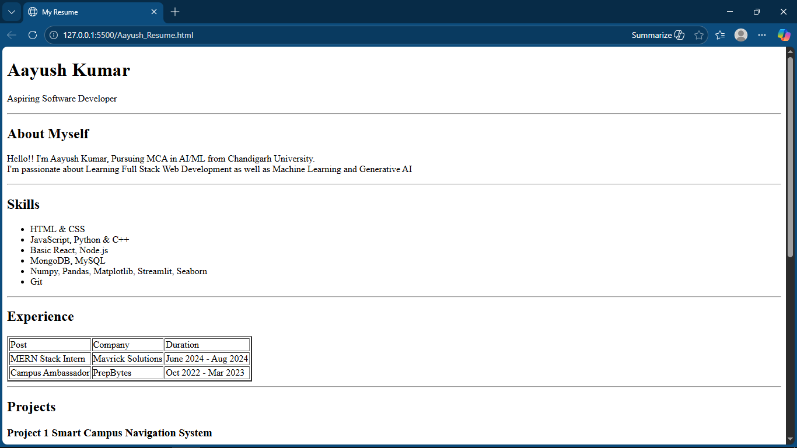
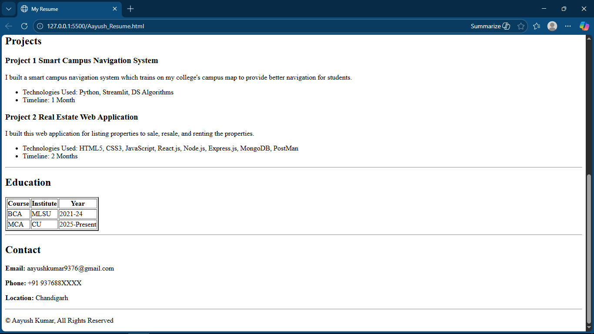

# Practice Resume Making

This repository contains a simple **HTML-based resume website** created to practice basic web development concepts.

## About the Project
The project is a single-page resume built using **pure HTML**. It focuses on proper use of HTML tags such as headings, lists, tables, and paragraphs.

## Output Preview

### Resume – Page 1

### Resume – Page 2

